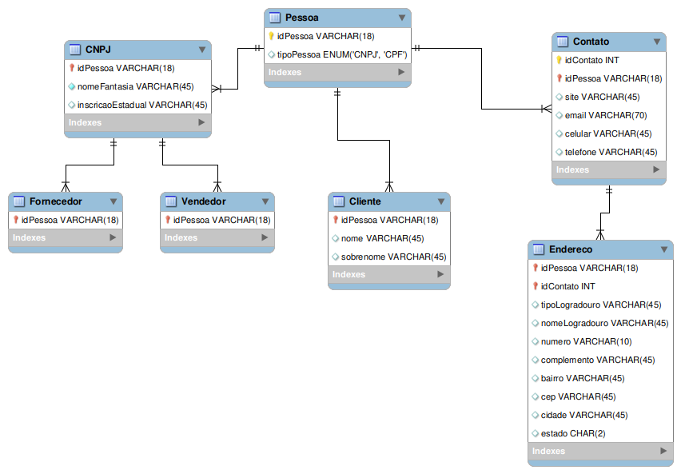

# Database Experience

##### Curso de Banco de Dados oferecido pela [DIO](https://www.dio.me), ministrado por [Juliana Mascarenhas](https://www.linkedin.com/in/juliana-mascarenhas-ds/).

------

### Projeto E-Commerce

Especificações:

- Cliente PJ e PF – Uma conta pode ser PJ ou PF, mas não pode ter as duas informações.

- O Cliente terá um ou mais endereços.

- O pedido pode ser realizado por um vendedor terceirizado

- Pagamento – Pode ter cadastrado mais de uma forma de pagamento;

- Entrega – Possui status e código de rastreio;

  

Modelo Entidade Relacionamento:

Desenvolvimento

A tabela Pessoa terá como chave primária  o CNPJ ou CPF.

[SQL - Pessoa](./SQL/Schema-Pessoa.sql)

[Mock SQL - Pessoa](./SQL/mock-pessoa.sql)

[Relatório SQL - Pessoa](./SQL/select-pessoa.sql) 

###### License: MIT
